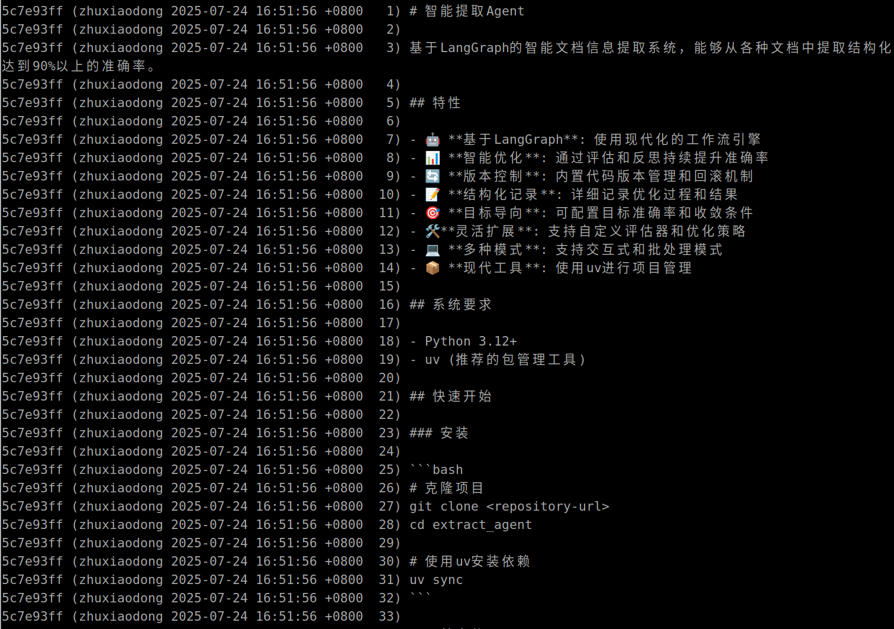
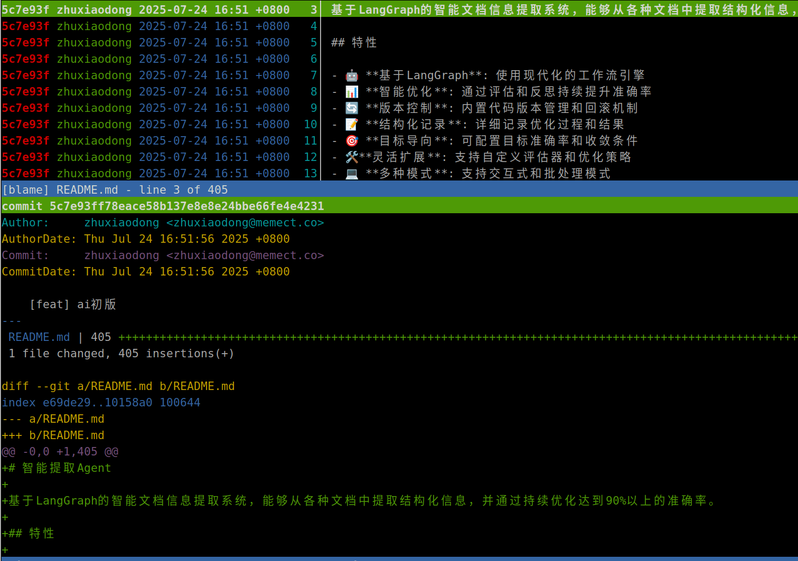
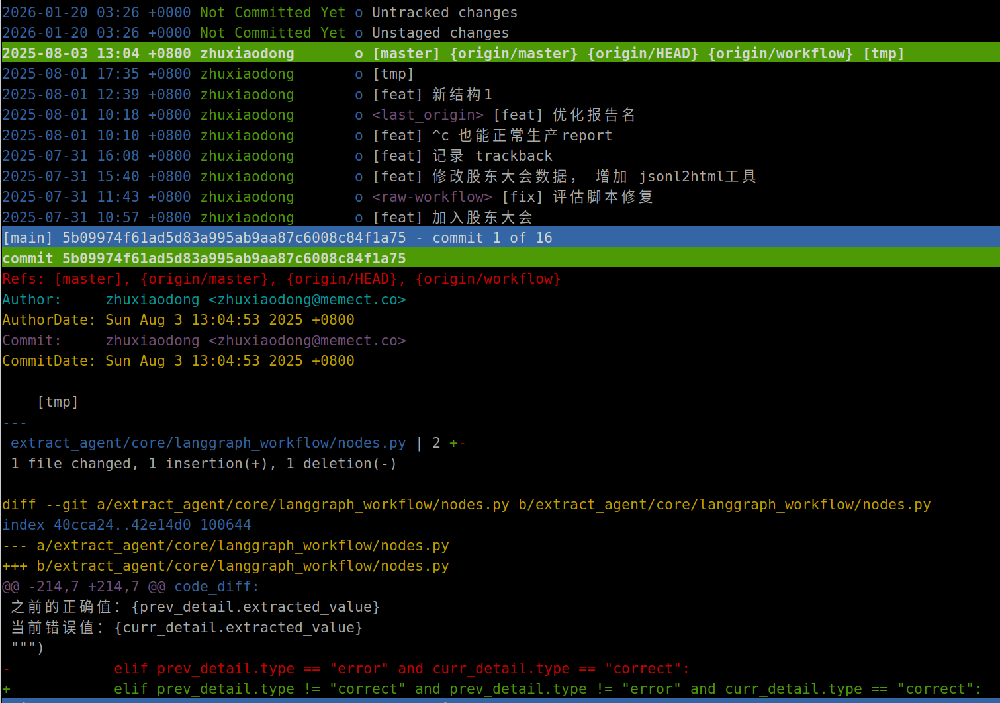

# 01-20 tig

## tig - 用更好看的方式看你的git仓库

tig 是一个基于 ncurses 的 Git 仓库浏览器，提供了一个直观的文本界面来浏览 Git 历史、查看差异和进行其他 Git 操作。



### 主要功能

- **Git 日志浏览**：`tig` 命令直接打开 Git 日志界面
- **代码差异查看**：可以查看提交之间的代码变化
- **blame 功能**：`tig blame <file>` 查看文件的行级作者信息
- **交互式操作**：支持键盘导航、搜索和快捷键操作





### 基本用法

```
tig                    # 浏览 Git 日志
tig blame README.md    # 查看 README.md 的 blame 信息
git blame README.md    # 对比原生 git blame 命令
```

### 安装

Ubuntu/Debian:
```
sudo apt install tig
```

macOS (Homebrew):
```
brew install tig
```

### 特点

- 界面简洁直观，比纯命令行更易用
- 支持鼠标操作（如果终端支持）
- 可以快速定位到特定的提交
- 支持搜索和过滤功能

参考：[如何使用 Tig 浏览 Git 日志](https://zhuanlan.zhihu.com/p/72554875)