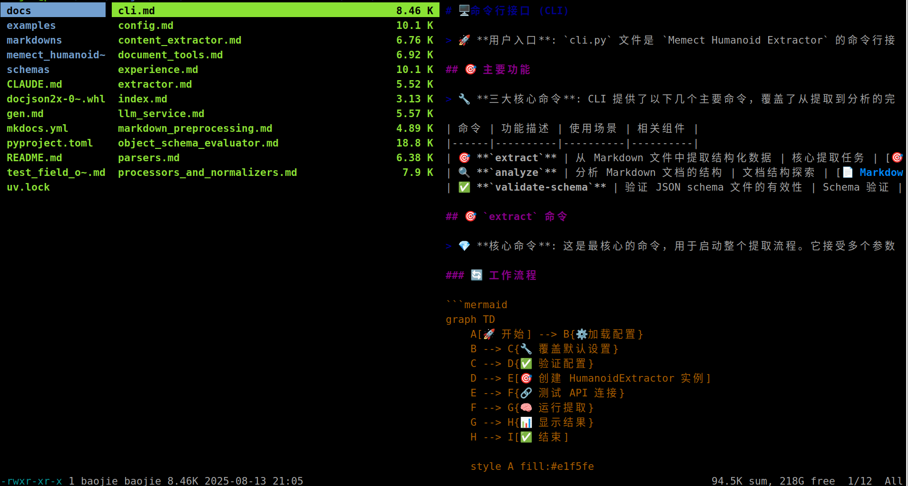
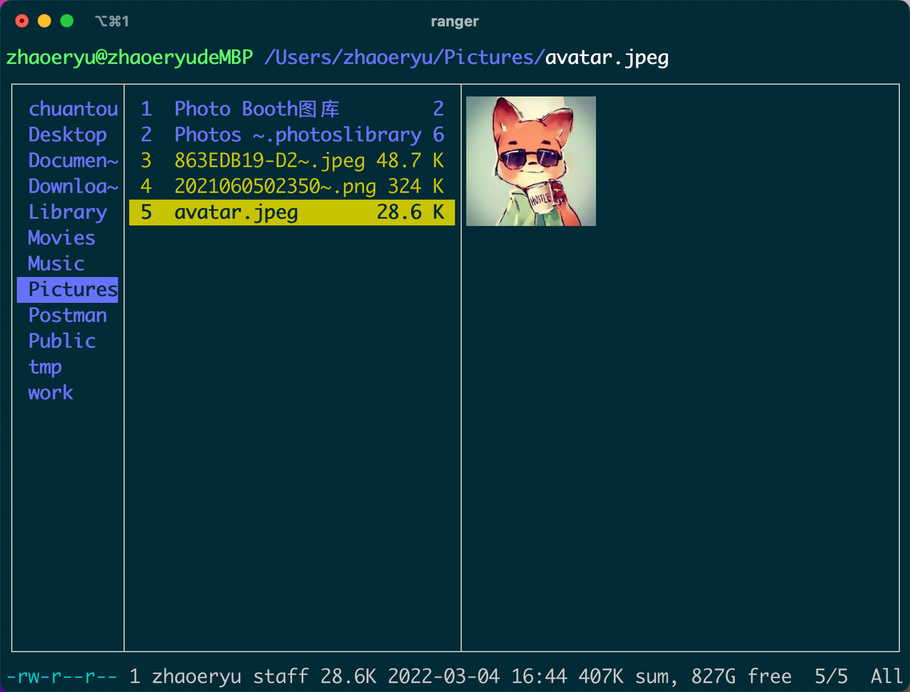

# 2026-01-21 ranger

## ranger - 终端文件管理器

今天的工具推荐ranger，Mac和Linux都可以用，是一个在终端中使用的文件管理器。





[用 ranger 在 Linux 终端管理你的文件 | Linux 中国](https://zhuanlan.zhihu.com/p/542347310)

### 安装

**macOS**
```
brew install ranger
```

**Ubuntu**
```
sudo apt-get install ranger
```