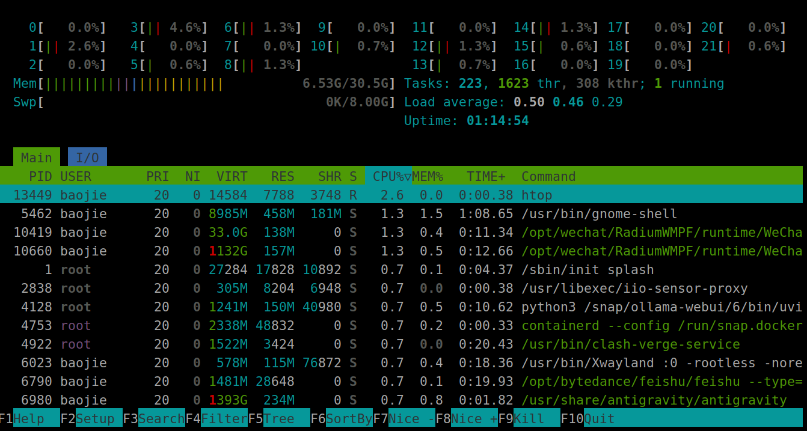
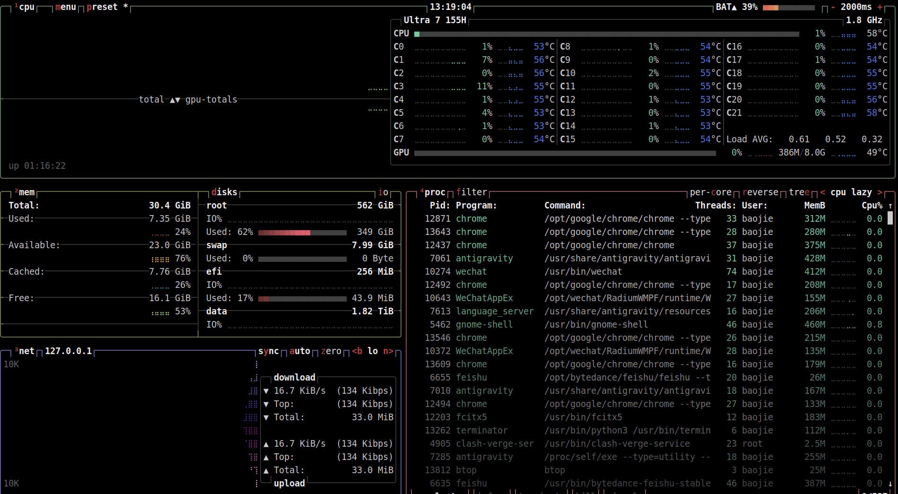
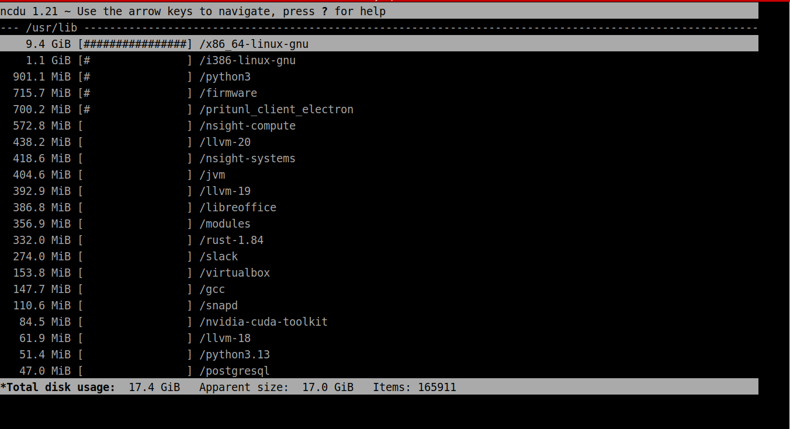
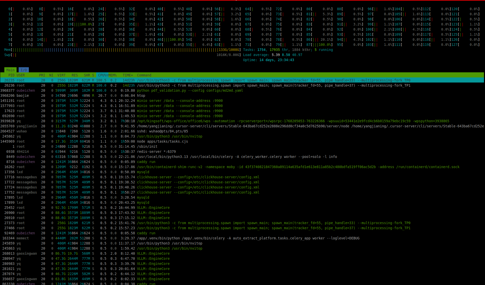

# 2026-01-22 htop btop ncdu

今天推荐一组基于NCurses的终端里的全屏 / 半屏交互工具，它让我们在终端里更容易地查看各种信息

## htop
htop是top的进化版，彩色的，而且可以进行过滤查找



[Htop简单教程](https://zhuanlan.zhihu.com/p/682957669)

## btop
btop, 一个更现代的监控系统



[Linux btop 使用教程](https://zhuanlan.zhihu.com/p/1901308308943528407)

## ncdu
我最喜欢的 ncdu,是 du的升级，方便查看硬盘空间，可以看各个子目录都有啥，无论是清理磁盘空间还是定位大文件，都太方便啦



[Linux系统之ncdu命令的基本使用](https://zhuanlan.zhihu.com/p/716545262)

安装都很容易:
```
apt install htop btop ncdu
```
mac上也有

给你们看看公司研发服务器laozi上的128核壮观景象 by htop

