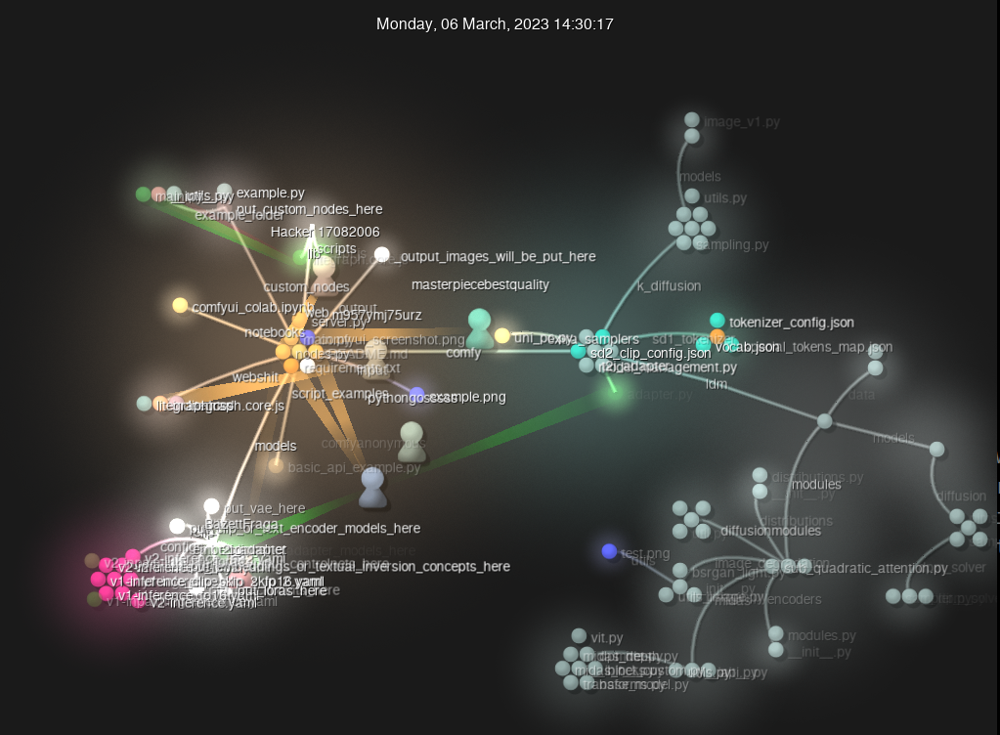

# 2026-01-23 gource

## gource - Git 仓库可视化工具

今天给大家推荐gource，把你的git repo的血泪史变成炫酷的动画

聊聊代码仓库可视化：gource 篇 https://zhuanlan.zhihu.com/p/512355700

给大家看个例子。是comfyui项目部分历史的可视化



```
gource \
  --seconds-per-day 0.1 \
  --auto-skip-seconds 1 \
  --hide mouse,progress \
  --stop-at-end \
  --output-ppm-stream - \
| ffmpeg \
  -y \
  -f image2pipe \
  -vcodec ppm \
  -r 60 \
  -i - \
  -c:v libx264 \
  -preset veryfast \
  -pix_fmt yuv420p \
  gource.mp4
```

用这条命令在那个repo下。如果只是要看视频gource就行了