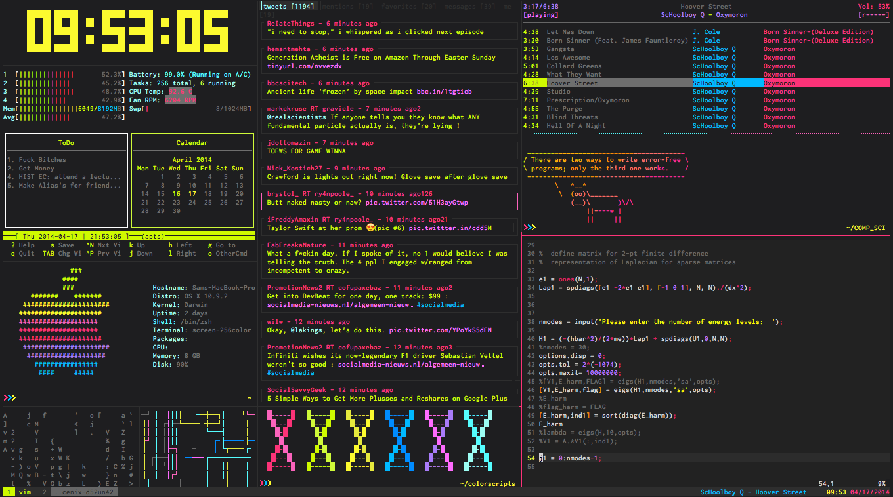
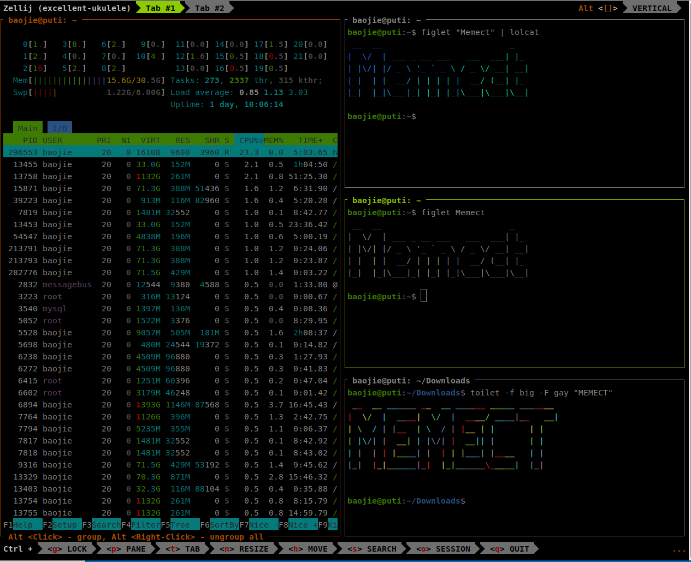

# 01-24 zellij和tmux

今天介绍终端复用器。为什么要有终端复用器，因为我们需要在TUI（字符界面）运行很多个应用，就像windows下要开很多窗口一样。你就可以理解终端复用器就是命令行界面下开很多窗口。这样我们就可以在一个终端对话里做好几件事。

最经典的是tmux，这个太经典了，几乎不用介绍了。主要缺点是各种命令要记，默认不支持鼠标。

```
apt-get install tmux （Linux）
brew install tmux    （Mac）
```

手把手教你使用终端复用神器 Tmux，丢掉鼠标不是梦 https://zhuanlan.zhihu.com/p/43687973

zellij是更现代的终端复用器。主要好处是支持鼠标，不需要记忆快捷键，有多tab，插件系统丰富。

* zellij - 比tmux更容易学习和上手的终端复用工具 https://www.bilibili.com/video/BV1NL411A77c/
* Rust 项目鉴赏: zellij 替代 screen, tmux 的终端工具 https://zhuanlan.zhihu.com/p/600682580
* 主页：https://zellij.dev/



安装，要用rust的包管理器cargo，我们选择直接安装二进制

```
cargo binstall zellij
```

如果还没有安装过cargo或binstall（不推荐使用apt）

```
curl --proto '=https' --tlsv1.2 -sSf https://sh.rustup.rs | sh
cargo install cargo-binstall
```


