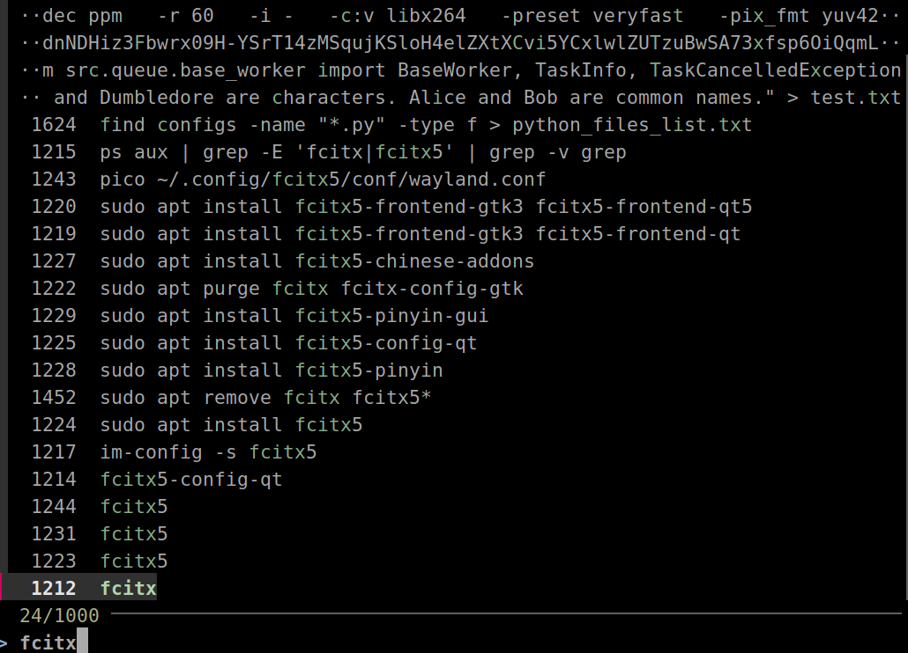

# fzf - 命令行模糊搜索工具

fzf 是一个命令行模糊搜索工具，用来解决一个所有终端用户都会遇到的问题：当列表太长时，如何快速、准确地选中你真正想要的那一项。


文件、命令历史、进程、SSH 主机、git 分支，本质上都是"可被选择的文本"，而 fzf 把这些选择过程变成了一个即时、流畅的交互体验。

## 相比 grep 和 find 的优势

传统工具如 grep 和 find 需要你提前知道精确的搜索模式，输错一个字符就得重新来。而 fzf 是交互式的：你边输入边看结果，随时调整关键词，支持模糊匹配，不用记住完整文件名。
更重要的是，fzf 把"搜索"和"选择"合二为一。用 find 找到文件后还要复制粘贴路径，用 grep 找到内容后还要手动定位。fzf 让你直接在搜索结果里选中想要的那一项，一步到位。

## 安装方式

macOS 用 Homebrew 一行搞定：

```
brew install fzf
```

Ubuntu/Debian 直接用 apt：

```
sudo apt install fzf
```

如果想要完整的命令行快捷键和自动补全，用官方脚本会更方便，它会自动配置好你的 shell 环境。

## 基础用法

直接运行 `fzf` 就能搜索当前目录文件，用方向键移动，回车确认。不需要完整匹配，记住几个字符就够。
更强大的是，fzf 可以接管任何文本流：

* **搜索命令历史**：`history | fzf`
* **查找指定文件**：`find . -type f | fzf`
* **快速定位进程**：`ps aux | fzf`
* **筛选 SSH 主机**：`cat ~/.ssh/known_hosts | cut -f 1 -d ' ' | fzf`
* **切换 git 分支**：`git branch | fzf`

只要是文本，就能变成可交互的选择器。

## 实用技巧

**预览文件内容**：`fzf --preview="cat {}"` 可以边选边看，配合 bat 体验更好：

```
fzf --preview="bat --color=always {}"
```

**多选模式**：`fzf --multi` 然后用 Tab 选择多个项目
**与其他工具结合**：

```
# 直接用 fzf 选文件再编辑
vim $(find . -type f | fzf)

# 快速跳转目录
cd $(find . -type d | fzf)
```

**自定义快捷键**：`fzf --bind='ctrl-k:kill-line'` 可以绑定你习惯的操作

## 查询语法速查表

在 fzf 的搜索框中，可以使用这些语法精确控制匹配规则：

|语法|说明|示例|
|---|---|---|
|`sbtrkt`|模糊匹配（默认）|匹配 "sub track"|
|`'wild`|精确匹配（包含 wild）|匹配 "wildcard"|
|^music|前缀匹配|匹配 "music.mp3"|
|.mp3$|后缀匹配|匹配 "song.mp3"|
|!fire|反向匹配（不包含）|排除包含 "fire" 的结果|
|!^music|反向前缀|排除以 "music" 开头的|
|!.mp3$|反向后缀|排除以 ".mp3" 结尾的|

**组合使用**：可以用空格分隔多个条件，例如：
* `^core go$ !main` - 以 "core" 开头，以 "go" 结尾，不包含 "main"
* `'exact !py` - 精确包含 "exact"，不包含 "py"

**快捷键**：
* `Tab` - 多选模式下选中/取消当前项
* `Ctrl-J/K` 或 `↓/↑` - 上下移动
* `Enter` - 确认选择
* `Ctrl-C` 或 `Esc` - 退出

**一句话总结**：fzf 不是一个单独的工具，而是一个让整个命令行"可交互化"的基础组件。一旦习惯，你会开始在每一个"列表"后面，自然地接上它。

`history | fzf`   范例