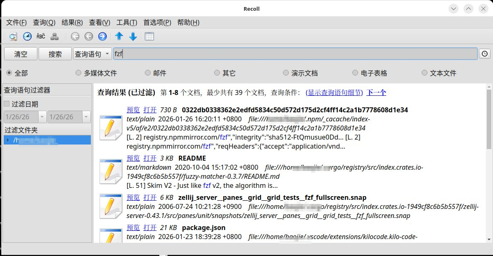

# Recoll 全文搜索工具指南

## 简介

Recoll 是一款基于 Xapian 引擎的桌面全文搜索工具，支持 Linux、Windows 和 macOS。

**核心优势：**
- **真正的全文检索** — 大多数搜索软件只能检索文件名，而 Recoll 可以深入文档内部，检索 PPT、Word、PDF、Excel 等文件中的实际文字内容
- 支持 200+ 文档格式（PDF、Office、邮件、压缩包等）
- 可索引嵌套内容（如压缩包中邮件附件里的 Word 文档）
- 支持中日韩等多语言，Unicode 内部编码
- 布尔搜索、短语搜索、通配符、词干提取
- 无需数据库服务，轻量独立



## 安装

```bash
# Ubuntu/Debian
sudo apt install recoll

# Arch Linux
sudo pacman -S recoll

# macOS
brew install recoll
```

## 索引指定目录

编辑配置文件 `~/.recoll/recoll.conf`：

```ini
topdirs = /home/user/Documents /home/user/Projects
skippedPaths = /home/user/Documents/tmp
```

执行索引：

```bash
recollindex              # 增量索引
recollindex -z           # 重建索引
recollindex -m           # 实时监控模式
```

## 搜索方式

### GUI 搜索

直接运行 `recoll`，在搜索框输入查询：
- `python tutorial` — 包含所有词
- `"machine learning"` — 精确短语
- `author:john ext:pdf` — 字段过滤
- `dir:/Projects date:2024` — 目录和日期过滤

### 命令行搜索

```bash
recollq 'python tutorial'              # 基本搜索
recollq 'ext:pdf machine learning'     # 限定 PDF
recollq -n 20 'keyword'                # 限制结果数
recoll -t 'query'                      # 等效于 recollq
```

## 与其他工具结合

### 配合 fzf 交互选择

```bash
recollq -b 'keyword' | fzf --preview 'head -50 {}'
```

### 配合 grep 二次过滤

```bash
recollq -b 'project' | xargs grep -l 'specific_term'
```

### 实用脚本示例

```bash
# 搜索并用 fzf 选择后打开
rsearch() {
    local file=$(recollq -b "$1" | fzf)
    [ -n "$file" ] && xdg-open "$file"
}
```

## 常用查询语法

| 语法 | 说明 |
|------|------|
| `word1 word2` | AND 关系 |
| `word1 OR word2` | OR 关系 |
| `-word` | 排除词 |
| `"exact phrase"` | 精确匹配 |
| `ext:pdf` | 文件类型 |
| `dir:/path` | 限定目录 |
