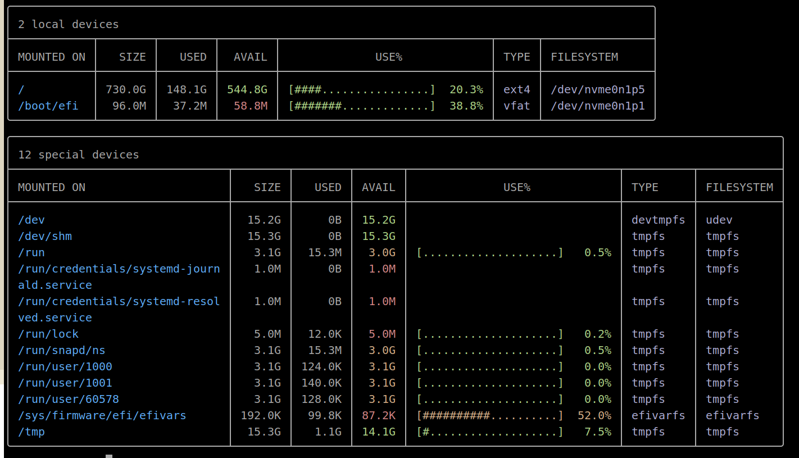
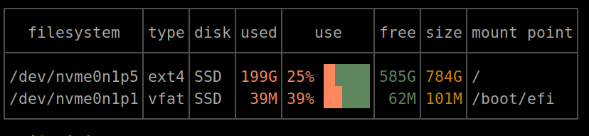
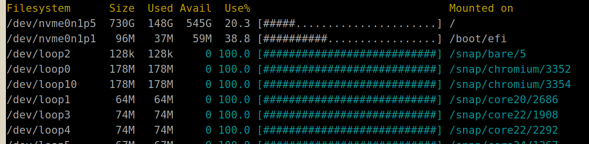

# 告别 df：现代磁盘空间查看工具

`df -h` 输出太丑？试试这几个现代替代品。

---

## 对照组：df

几十年如一日的经典命令。能用，但纯白文本、文件系统混杂，肉眼难以快速定位问题。

```
$ df -h
Filesystem      Size  Used Avail Use% Mounted on
udev            3.9G     0  3.9G   0% /dev
tmpfs           798M  8.4M  790M   2% /run
/dev/sda1       234G  187G   35G  85% /
tmpfs           3.9G     0  3.9G   0% /dev/shm
/dev/sdb1       916G  412G  458G  48% /data
tmpfs           798M     0  798M   0% /run/user/1000
```

---

## 1. duf

- 语言：Go
- 平台：Linux / macOS / Windows / BSD / Android
- GitHub：https://github.com/muesli/duf （13k+ stars）

**最流行的 df 替代品。** 彩色表格 + 使用率进度条 + 自动分组（本地/网络/虚拟设备分开显示），一眼看出哪个盘快满了。支持排序、过滤、JSON 输出。



安装：

```bash
# Ubuntu 22.04+
sudo apt install duf
# macOS
brew install duf
# Arch
sudo pacman -S duf
```

---

## 2. dysk

- 语言：Rust
- 平台：仅 Linux
- GitHub：https://github.com/Canop/dysk （前身 lfs）

**运维利器。** 自动识别磁盘类型（SSD / HDD / 可移动），支持强大的布尔过滤表达式，适合写监控脚本。



注意 `disk` 列会标注磁盘类型（SSD / HDD / rem），这是 df 和 duf 都没有的功能

过滤示例：

```bash
# 只看使用率超过 80% 的 SSD
dysk -f 'use > 80% & disk = SSD'

# 只看大于 5TB 的 xfs 非远程文件系统
dysk -f 'type = xfs & !remote & size > 5T'
```

安装：

```bash
# Ubuntu 22.04+
sudo apt install dysk
# 或用 Cargo
cargo install --locked dysk
```

---

## 3. pydf

- 语言：Python
- 平台：Linux / Unix

**最轻量的方案。** 就是给 df 加个彩色条形图，没有多余功能。适合只想"好看一点的 df"的用户。



安装：

```bash
sudo apt install pydf
```

---

## 4. discus

- 语言：Python
- 平台：Linux

**高度可定制。** 通过 `~/.discusrc` 配置颜色方案、数字格式、显示哪些挂载点。输出带条形图和彩色标注。

```
$ discus
Mount        Total     Used    Avail   Pct   Graph
/              234G     187G      35G   85%   |*****************...|
/data          916G     412G     458G   48%   |*********...........|
/boot/efi      512M     5.8M     506M    1%   |....................|
```

安装：

```bash
sudo apt install discus
```

---

## 横向对比

| 特性 | duf | dysk | pydf | discus |
|------|-----|------|------|--------|
| 语言 | Go | Rust | Python | Python |
| 跨平台 | 全平台 | 仅 Linux | Linux/Unix | Linux |
| 彩色进度条 | 有 | 有 | 有 | 有 |
| 自动分组 | 有 | 无 | 无 | 无 |
| 磁盘类型识别 | 无 | 有（SSD/HDD/rem） | 无 | 无 |
| 过滤表达式 | 简单 | 布尔表达式 | 无 | 无 |
| JSON 输出 | 有 | 有 | 无 | 无 |
| 安装难度 | 简单 | 简单 | 简单 | 简单 |

---

## 注意：df 和 du 是两回事

df 看的是分区/文件系统的整体空间，du 看的是目录/文件的具体占用。如果你想找"哪个目录占了这么多空间"，需要的是 ncdu、gdu、dust 这类 du 替代品，不在本文讨论范围内。

---

## 推荐

- **日常使用** -- duf，最省心，装上直接用
- **服务器运维** -- dysk，过滤表达式 + 磁盘类型识别，脚本友好
- **极简主义** -- pydf，只加颜色，不加复杂度

终极方案：在 `.bashrc` 里写一行 `alias df='duf'`，从此眼不见心不烦。

---

## 彩蛋：过滤掉 loop 设备

Ubuntu 用 snap 后会产生一堆 `/dev/loop*`，看着烦？

```bash
# duf 自动隐藏，无需操作
# dysk
dysk -f '!loop'
# pydf
pydf | grep -v loop
```
